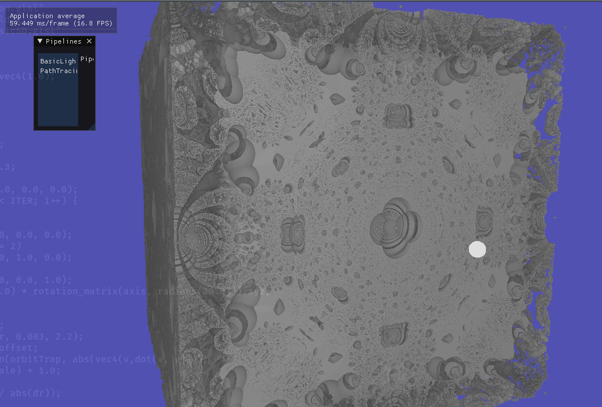

# Phosphene_ashes (ashes of phosphene)

Ah better than the other Vulkan repo.

This one is being rebuild on a currently private repo.

Changing the architecture this one was suppose to be redone anyway.

that was the sketch for the project and learning RTX pipelines.

## Project

Global illumination Renderer with Raymarching + Raytracing using RTX pipelines.

Can load spv shader from json scene and render any form. 

## Exemples

#### Path-tracing

#### No illumination (only fake ambiant by number of iterations)

