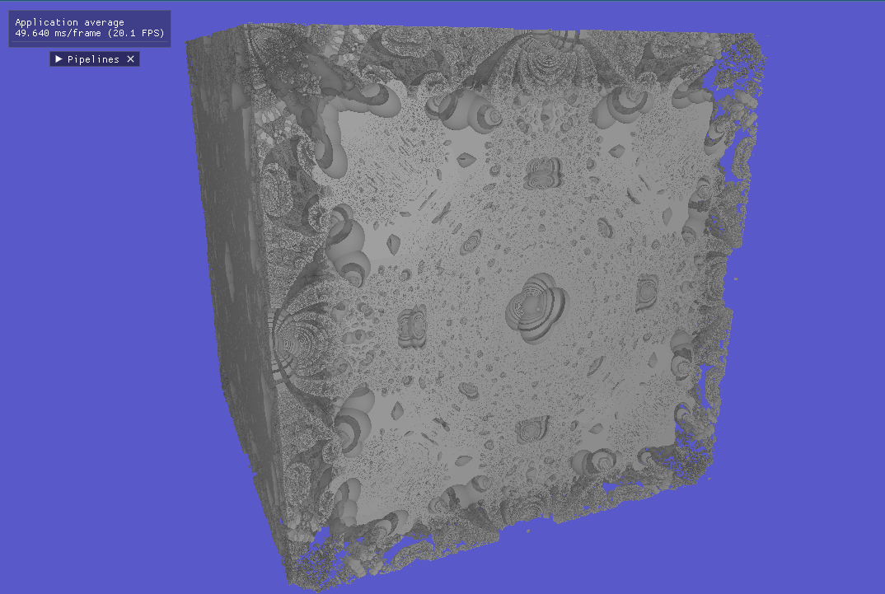

# Phosphene_ashes (ashes of phosphene)

Ah better than the others Vulkan repo.

This one is being rebuild on a currently private repo, changing the architecture this one was suppose to be redone anyway.

that was the sketch for the project and learning RTX pipelines.

Currently this program doesn't choose the device it just take the first one that happen to be the one I need in my PC
(will be added just to make it work on other platforms).

## Project

Global illumination Renderer with Raymarching + Raytracing using RTX pipelines.

Can load spv shader from json scene and render any form. 

## Exemples

#### Path-tracing

#### No illumination (only fake ambiant by number of iterations)

